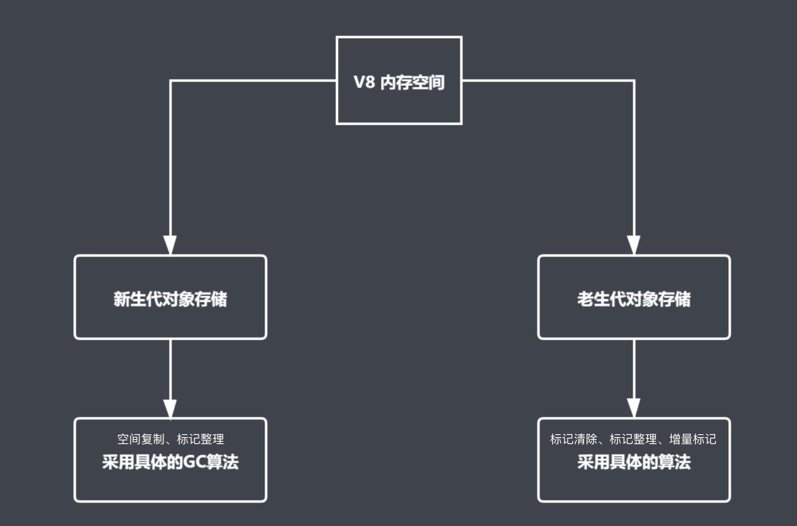

# ES6
  * 带标签函数的模版字符串
  ```
  // 可计算，对比 vue 的计算属性 computed
  function myTagFunc (strings, name, gender) {
    // console.log(strings, name, gender)
    // return '123'
    const sex = gender ? 'man' : 'woman'
    return strings[0] + name + strings[1] + sex + strings[2]
  }

  const result = myTagFunc`hey, ${name} is a ${gender}.`

  console.log(result)
  ```
  * 对象字面量的计算属性
  ```
  const obj = {
    foo: 123,
    bar,
    // 方法可以省略 : function
    method1 () {
        console.log('method111')
        // 这种方法就是普通的函数，同样影响 this 指向。
        console.log(this)
    },
    // 通过 [] 让表达式的结果作为属性名
    [Math.random()]: 123
  }
  
  // PS: false
  NaN === NaN
  ```
  * Proxy
    * 使用场景
    > 监听对象 读/写 的代理器，拥有比 defineProperty 方法更强大更全面的功能，可以完全取代 Object.defineProperty()，vue 源码数据响应式核心处理就用到了这个方法
    * 形式
    ```
    const person = {
        name: 'zce',
        age: 20
    }

    const personProxy = new Proxy(person, {
        // 监听属性读取
        get (target, property) {
            // 由代理完成对象的读取
            return property in target ? target[property] : 'default'
        },
        // 监视属性写入
        set (target, property, value) {
            // 由代理完成对象的写入，可自定义前置操作，扩展性更强
            if (property === 'age') {
            if (!Number.isInteger(value)) {
                throw new TypeError(`${value} is not an int`)
            }
            }

            target[property] = value
        }
        // 监听属性删除，此操作 defineProperty 没有
        deleteProperty (target, property) {
            console.log('delete', property)
            delete target[property]
        }
    })

    // 监听数组
    const listProxy = new Proxy(list, {
        set (target, property, value) {
            console.log('set', property, value)
            target[property] = value
            return true // 表示设置成功
        }
    })

    listProxy.push(100)
    listProxy.push(100)

    ```
    * 更多操作
    
  * Reflect
    * 使用场景
    > 提供了一整套对象操作方法用以替代原来的那些对象操作方法，建议使用 Reflect 去对对象进行操作
    * 更多操作
    
  * 类和继承
    ```
    class Person {
        // 相当于构造函数 new Person(name)
        constructor (name) {
            this.name = name
        }

        say () {
            console.log(`hi, my name is ${this.name}`)
        }
    }

    class Student extends Person {
        constructor (name, number) {
            // 调用父类构造函数
            super(name) 
            this.number = number
        }

        hello () {
            // 调用父类成员
            super.say() 
            console.log(`my school number is ${this.number}`)
        }
    }

    const s = new Student('jack', '100')
    s.hello()
    ```
  * Symbol
    * 使用场景
    > 主要为对象添加独一无二的 key 和 私有变量
    * 形式
    ```
    console.log(
        // false
        Symbol() === Symbol(),
        // false
        Symbol('foo') === Symbol('foo')
    )

    const s1 = Symbol.for('foo')
    const s2 = Symbol.for('foo')
    // true
    console.log(s1 === s2)

    const obj = {
        [Symbol()]: 'symbol value',
        foo: 'normal value'
    }

    for (var key in obj) {
        // 获取不到 Symbol
        console.log(key)
    }
    // 获取不到 Symbol
    console.log(Object.keys(obj))
    // 获取不到 Symbol
    console.log(JSON.stringify(obj))
    // 可以获取到 Symbol
    console.log(Object.getOwnPropertySymbols(obj))
    ```
  * for ... of
    * 使用前提
    > 使用对象内部已经实现了 可迭代接口 iterator
    * 迭代器模式
    > 数据对象的创建者内部实现 可迭代接口，使得用户无需关心对象内部数据结构，只需要使用 for ... of 遍历数据即可取出所有待处理数据
    * 形式
    ```
    // 常规实现 iterator 方法
    const todos = {
        // 外部数据
        life: ['吃饭', '睡觉', '打豆豆'],
        learn: ['语文', '数学', '外语'],
        work: ['喝茶'],
        // 内部 Symbol.iterator 常量为 key，返回带有 next() 的对象
        [Symbol.iterator]: function () {
            const all = [...this.life, ...this.learn, ...this.work]
            let index = 0
            // 返回带有 next() 的对象
            return {
                next: function () {
                    // 返回 {value, done: Boolean}
                    return {
                        value: all[index],
                        done: index++ >= all.length
                    }
                }
            }
        }
    }

    // 使用 Generator 函数实现 iterator 方法
    const todos = {
        // 外部数据
        life: ['吃饭', '睡觉', '打豆豆'],
        learn: ['语文', '数学', '外语'],
        work: ['喝茶'],
        // 内部 Symbol.iterator 常量
        [Symbol.iterator]: function * () {
            const all = [...this.life, ...this.learn, ...this.work]
            for (const item of all) {
                yield item
            }
        }
    }

    for (const item of todos) {
        console.log(item)
    }
    ```
  * 指数运算符 (ES2016)
    > Math.pow(2, 10) 等价于 2 ** 10
# Flow
  * 一个为 JavaScript 提供类型检查的工具，只在开发环境提供类型检查，通过编译后的文件用于生产环境。
  * 目前最流行的类型检查解决方案是 Typescript，Flow 仅供学习了解和学习 Vue/React 源码使用，因为 Vue/React 源码里使用了 Flow 进行类型检查。
# TypeScript
  * 枚举 
    > 直接使用 enum 关键字创建枚举键值对可双向访问，使用 const enum 则值不能访问到键
    * 数字类型的枚举可以自增
    ```
    // 数字枚举，枚举值自动基于前一个值自增
    enum PostStatus {
       // 第一个值不赋值的话默认是 0
       Draft = 6,
       Unpublished, // => 7
       Published // => 8
    }
    ```
  * 类
  ```
  class Person {
    // 默认就是 public 修饰
    public name: string // = 'init name'
    // 私有成员，只能 Person 内部访问
    private age: number
    // 受保护成员，只能 Person 及其 子类 访问
    // 只读成员，不能修改值
    protected readonly gender: boolean
    
    constructor (name: string, age: number) {
        this.name = name
        this.age = age
        this.gender = true
    }

    sayHi (msg: string): void {
        console.log(`I am ${this.name}, ${msg}`)
        console.log(this.age)
    }
  }
  ```
  * 类与接口
  ```
  interface Eat {
    // 定义一个函数类型，不负责具体实现
    eat (food: string): void
  }

  interface Run {
    // 定义一个函数类型，不负责具体实现
    run (distance: number): void
  }

  // Person 负责具体实现以上接口定义的类型
  class Person implements Eat, Run {
    eat (food: string): void {
        console.log(`优雅的进餐: ${food}`)
    }

    run (distance: number) {
        console.log(`直立行走: ${distance}`)
    }
  }
  ```
  * 抽象类
  ```
  // abstract 关键字定义抽象类
  // 抽象类只能被继承，不能实力化
  abstract class Animal {
    eat (food: string): void {
        console.log(`呼噜呼噜的吃: ${food}`)
    }
    // 定义抽象方法，不需要具体实现，只需要定义函数方法类型
    abstract run (distance: number): void
  }

  // extends 关键字继承
  class Dog extends Animal {
    // 具体实现定义的抽象方法
    run(distance: number): void {
        console.log('四脚爬行', distance)
    }
  }

  const d = new Dog()
  d.eat('嗯西马')
  d.run(100)
  ```
  * 泛型
  ```
  // 创建指定长度的数字类型数组
  function createNumberArray (length: number, value: number): number[] {
    const arr = Array<number>(length).fill(value)
    return arr
  }

  // 创建指定长度的字符串类型数组
  function createStringArray (length: number, value: string): string[] {
    const arr = Array<string>(length).fill(value)
    return arr
  }

  // 使用泛型简化以上代码实现，实际上就是把不能确定的类型当作动态参数 T 去处理了
  function createArray<T> (length: number, value: T): T[] {
    const arr = Array<T>(length).fill(value)
    return arr
  }

  // const res = createNumberArray(3, 100)
  // res => [100, 100, 100]

  const res = createArray<string>(3, 'foo')
  ```
  * 类型声明
  > 在 Typescript 中使用第三方模块时，需要其对应的 .d.ts 文件，也就是对应的类型声明文件，这样在开发时 Typescript 才能识别这个模块。一般大多数第三方模块都已经提供了，只需要 install -dev @types/... ，注意这里是开发依赖，因为 typesctipt 是在开发时提供类型检查语法，编译后就是普通代码，很多第三方模块在 install 的时候就已经自带了 @types/... 对应的声明文件了，如果没有则需要使用 typescript 的 declear 关键字声明在模块中使用的那些方法赌赢的类型
# 性能优化
  * 垃圾回收[GC -- Garbage Collection 算法]
    * 引用计数算法
       * 优点
         * 立即回收垃圾对象，减少程序卡顿时间
       * 缺点
         * 不能回收循环引用对象[函数内部定义的互相引用对象]
         * 资源消耗较大[需要对引用对象计数，遇到引用对象引用数量较大时资源消耗大]
    * 标记清除算法
       * 优点
         * 可以回收循环引用对象
       * 缺点
         * 不能立即回收垃圾对象
         * 容易产生碎片化空间[回收放入到空闲链表的地址不连续，不方便外部对空闲链表再次申请内存空间]
    * 标记整理算法
       * 优点
         * 减少碎片化空间 
       * 缺点
         * 不能立即回收垃圾对象
         * 在回收前移动对象位置，回收效率慢
  * V8 引擎
    * 内存设上限[为浏览器服务，设定上限提升效率]
    * 垃圾回收机制
    
    * 新生代
      * 新生代对象指存活时间较短的对象[临时变量，函数内部变量等执行完需要马上释放空间的变量]
      * V8 划分一个 32M|16M 的内存空间用于存放新生代对象
      * 新声代对象存储空间内部又划分2个等大的空间[Form:  活动对象存储空间 | To: 空闲空间]
      * 触发 GC 算法流程[此过程可能产生晋升]:
        * 从 From 标记整理后将活动对象拷贝到 To
        * From 和 To 空间交换[地址交换]，至此 From 空间释放，To 存放新生代活动对象
      * 晋升[将新生代对象移动至老生代]的条件
        * 从 From 拷贝对象过程中发现该对象在老生代中有引用
        * 经过一轮 GC 操作后还存活的新生代对象
        * To 的空间使用率超过了 25%
    * 老生代
      * 老生代对象指存活时间较长的对象[全局引用，闭包等多重引用的对象]
      * 8 划分一个 1.4G[64位]|700M[32位] 的内存空间用于存放新生代对象
      * 触发 GC 算法流程
        * 标记清除完成垃圾回收
        * 标记整理优化空间
        * 增量标记优化效率
        
  * 堆栈中的执行过程
    
  * Chrome Performance 性能监控
      * 观察 Timeline 时序图[鼠标指向明显变化的时间节点可看到对应的网页截图，进而间接找到对应的代码块]
        * 折线陡然上升说明有内存泄露
        * 走势在较短时间内波动频繁说明此处有频繁 GC 操作[频繁的 GC 操作会使得网页卡顿，因为 GC 操作也会阻塞代码进程]
  * 代码优化
      * For 循环优化
      ```
      // 提前缓存数组长度，不用每次循环都获取一次
      for (var i = arrList.length; i; i--) {
        console.log(arrList[i])
      }

      // 这种更快，区别是从后往前循环，但是代码量和循环体内所做的事更少
      let len = arrList.length
      while (len--) {
        console.log(arrList[len])
      }
      ```
      * 最优循环方法
        * forEach > for[优先缓存数组长度] > for...in
      * 字面量方式定义变量 > new 关键字去定义[new 是去执行构造函数，多了一步函数执行操作]